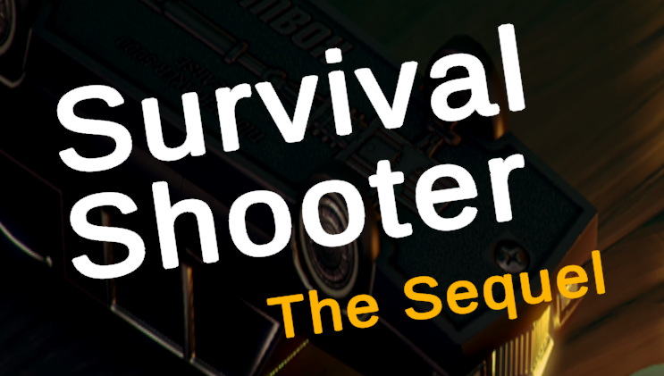
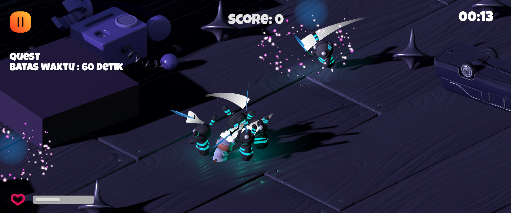
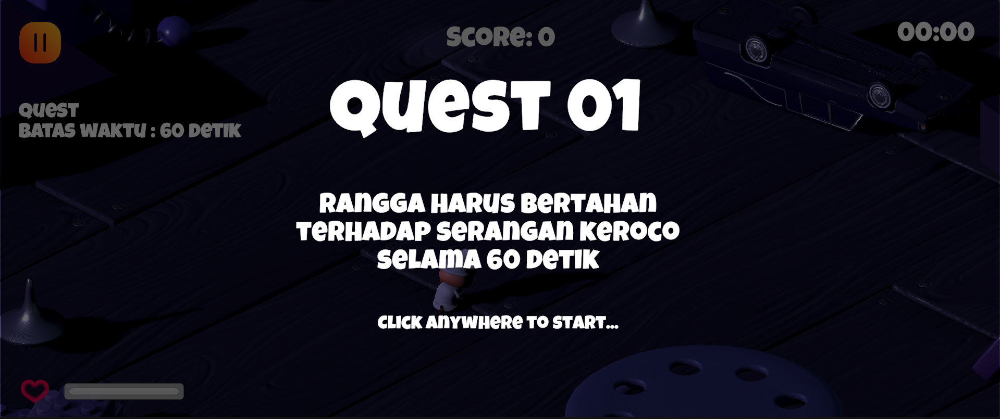
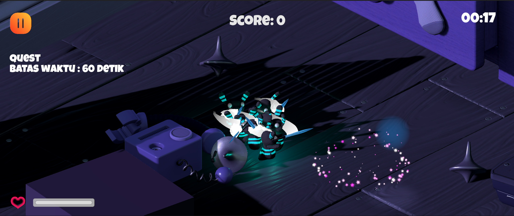
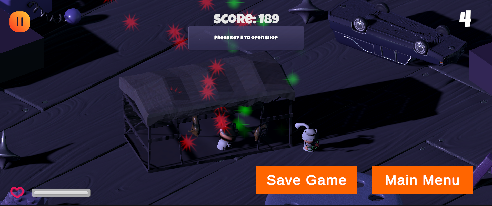
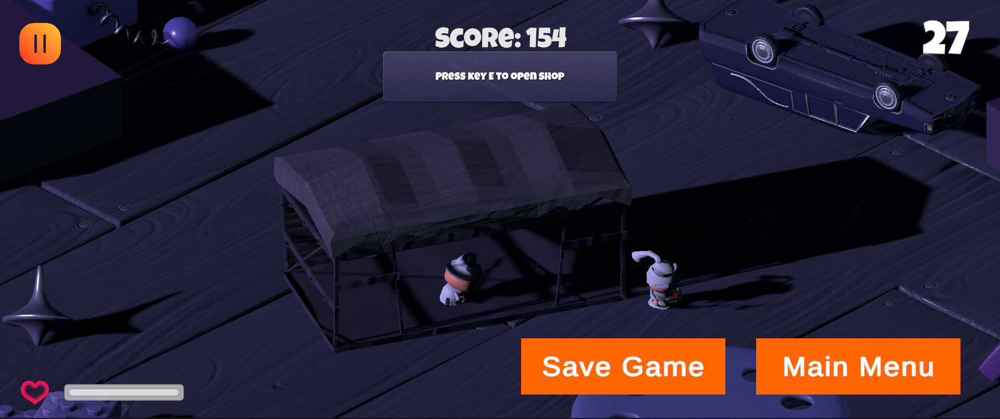
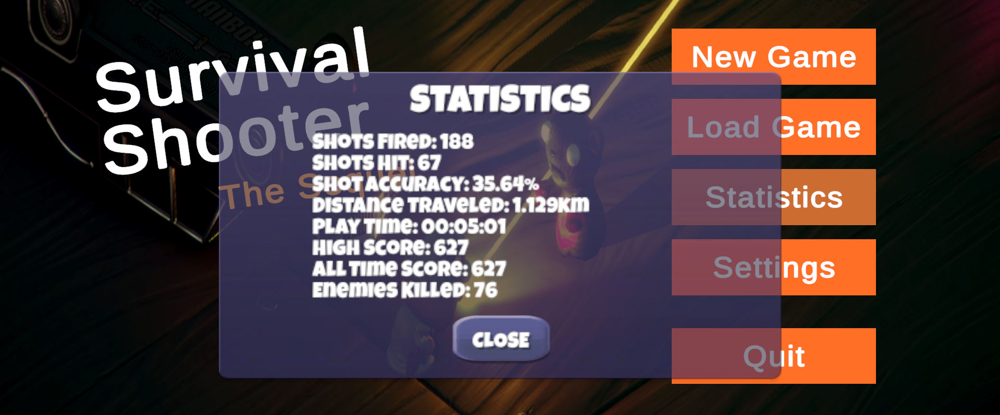
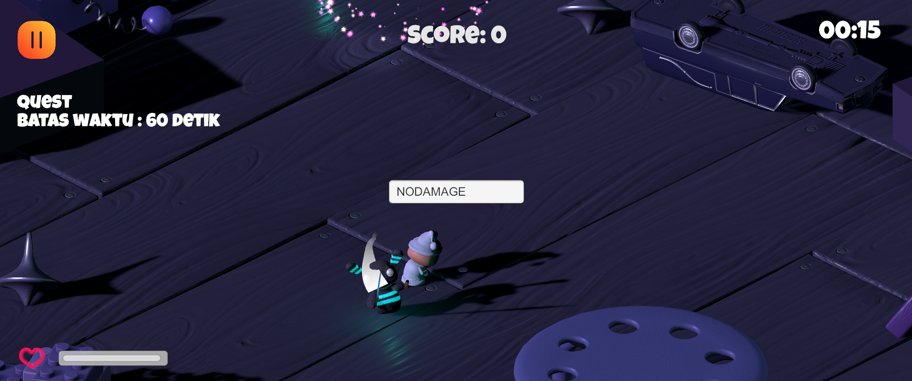
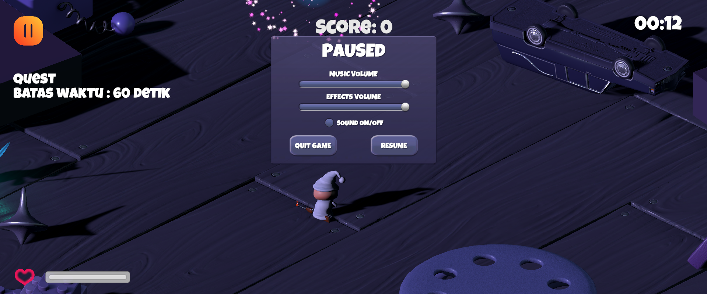
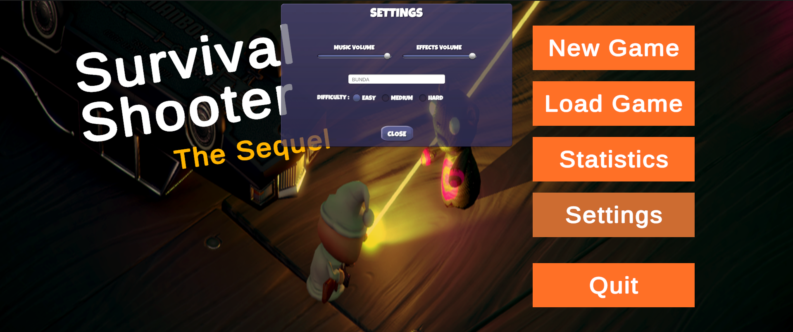

<br>
<div align="center">
    <div >
        
    </div>
    <br>
    <div>
            <h3>Survival Shooter: The Sequel</h3>
            <p><i>Extended version of Survival Shooter game from Unity tutorial</i></p>
    </div>
</div>
<br>

<h1 align="center">Survival Shooter: The Sequel Game</h1>



Survival Shooter: The Sequel expands upon the original Unity tutorial with a wealth of new features. Dive into a world ravaged by Keroco, monstrous frog-like creatures. Embark on 4 challenging quests, following a captivating narrative revealed through 3 cinematic cut-scenes. Progress is tracked with a save system, ensuring your hard-earned victories aren't lost. Failing a quest or depleting your health results in a game over, but don't worry, you can review your performance through detailed gameplay statistics.

The enhanced main menu lets you fine-tune the experience. Adjust audio levels, toggle sound effects, and select difficulty to find your perfect challenge.  A loyal pet companion, purchasable with in-game currency earned from quests, fights alongside you.  Conquer a variety of enemies – from the basic Keroco to the formidable Raja Keroco and Jendral Keroco.  Multiple weapon types, including a default weapon, shotgun, and sword, offer strategic combat options.  Enhance your abilities with power-ups found within mysterious orbs scattered throughout the world. And for those who want to push the boundaries, a selection of cheats is available for a truly wild experience. With Survival Shooter: The Sequel, the adventure awaits!

## 📝 Table of Contents
- [General Information](#general-information)
- [Tech Stacks and Platforms](#tech-stacks-and-platforms)
- [Libraries](#libraries)
- [Main Features](#main-features)
- [Bonus 1 - Build to Android](#bonus-1---build-to-android)
- [Bonus 2 - Multitype Input](#bonus-2---multitype-input)
- [Bonus 3 - Skill Cutscene](#bonus-3---skill-cutscene)
- [Bonus 4 - AR Version](#bonus-4---ar-version)
- [Task Division](#task-division)
- [Contributors](#contributors)

## 📢 General Information
The construction project of the Bandung Bondowoso temple was a great success due to the Android application created by his genie. As a result, he gained immense wealth. Confused about how to spend his fortune, Bandung Bondowoso decided to assemble a PC so that he could play AAAA games. However, he felt that AAAA games did not meet his expectations. Therefore, Bandung Bondowoso asked for help from his genie to create a new game.

The genie of Bandung Bondowoso had previously tried to create a game from the [Unity tutorial](https://youtube.com/playlist?list=PL871udVFq7OF9w5RBjyp_lcyzFuViLe8x&si=gxYZvMOM8I1uHX8w) that is also available [here](https://drive.google.com/drive/folders/1kKue0ELQlIqWxppyJ0h3W-LZBtxNb2Up?usp=sharing). Therefore, the genie of Bandung Bondowoso decided to modify the game to make it more challenging.

## 👨🏻‍💻 Tech Stacks and Platforms
<div align="center">
<kbd>

</kbd>
<kbd>

</kbd>
<kbd>

</kbd>
</div>
<div align="center">
<h4>Unity | Visual Studio | Android</h4>
</div>

## 📖 Libraries
Here's list of libraries that used in this project.
<table style="width:100%">
  <col width="35%">
  <col width="65%">
  <tr>
    <th>Libraries</th>
    <th>Purposes</th>
  </tr>
  <tr>
    <td>TextMeshPro</td>
    <td>Enables advanced text rendering with better performance and visual enhancements.</td>
  </tr>
  <tr>
    <td>Timeline</td>
    <td>Creates cinematic sequences and animations with control over cameras, sound, and transitions.</td>
  </tr>
  <tr>
    <td>Unity UI</td>
    <td>Builds user interfaces within the game, including menus, buttons, and health bars.</td>
  </tr>
  <tr>
    <td>Newtonsoft Json</td>
    <td>Parses and manipulates JSON data for saving game data or working with external sources.</td>
  </tr>
  <tr>
    <td>Version Control</td>
    <td>Tracks changes to project files over time, allowing reverts and collaboration.</td>
  </tr>
  <tr>
    <td>Visual Scripting</td>
    <td>Creates game logic visually with nodes instead of writing code.</td>
  </tr>
</table>

And some **Unity core libraries** like Unity, UnityEngine, System, and many more!

## ⭐ Game Flows
Here's Survival Shooter The Sequel main game flows and its interface.
<table style="width:100%; text-align:center;">
    <col width="49%">
    <col width="49%">
    <tr>
        <td width="1%" align="center"></td>
        <td width="1%" align="center"></td>
    </tr>
    <tr>
        <td width="1%" align="center">Main Menu</td>
        <td width="1%" align="center">Opening Cutscene</td>
    </tr>
    <tr>
        <td width="1%" align="center"></td>
        <td width="1%" align="center"></td>
    </tr>
    <tr>
        <td width="1%" align="center">Dialogue Cutscene</td>
        <td width="1%" align="center">Quest Detail</td>
    </tr>
    <tr>
        <td width="1%" align="center"></td>
        <td width="1%" align="center"></td>
    </tr>
    <tr>
        <td width="1%" align="center">Shotgun Demo</td>
        <td width="1%" align="center">Sword Demo</td>
    </tr>
    <tr>
        <td width="1%" align="center"></td>
        <td width="1%" align="center"></td>
    </tr>
    <tr>
        <td width="1%" align="center">Mobs</td>
        <td width="1%" align="center">Orb Power Up</td>
    </tr>
    <tr>
        <td width="1%" align="center"></td>
        <td width="1%" align="center"></td>
    </tr>
    <tr>
        <td width="1%" align="center">Pet</td>
        <td width="1%" align="center">Shopkeeper</td>
    </tr>
    <tr>
        <td width="1%" align="center"></td>
        <td width="1%" align="center"></td>
    </tr>
    <tr>
        <td width="1%" align="center">Statistics</td>
        <td width="1%" align="center">Cheat</td>
    </tr>
    <tr>
        <td width="1%" align="center"></td>
        <td width="1%" align="center"></td>
    </tr>
    <tr>
        <td width="1%" align="center">Pause</td>
        <td width="1%" align="center">Game Over</td>
    </tr>
    <tr>
        <td width="1%" align="center"></td>
        <td width="1%" align="center"></td>
    </tr>
    <tr>
        <td width="1%" align="center">Load Game</td>
        <td width="1%" align="center">Save Game</td>
    </tr>
    <tr>
        <td width="1%" align="center"></td>
        <td width="1%" align="center"></td>
    </tr>
    <tr>
        <td width="1%" align="center">Settings</td>
        <td width="1%" align="center">Quest Completed</td>
    </tr>
</table>

## 📱 Bonus 1 - Build to Android
<table style="width:100%; text-align:center;">
    <col width="49%">
    <col width="49%">
    <tr>
        <td width="1%" align="center"></td>
        <td width="1%" align="center"></td>
    </tr>
    <tr>
        <td width="1%" align="center">Android View #1</td>
        <td width="1%" align="center">Android View #2</td>
    </tr>
    <tr>
        <td width="1%" align="center"></td>
        <td width="1%" align="center"></td>
    </tr>
    <tr>
        <td width="1%" align="center">Android View #3</td>
        <td width="1%" align="center">Android View #4</td>
    </tr>
</table>
Here is how we build the Survival Shooter: The Sequel into Android:

1. **Open the Unity project.**
2. **Configure Build Settings:** Go to `File > Build Settings`.
3. **Switch Platform**: In the Build Settings window, select "Android" from the platform list and click "Switch Platform" to configure settings for Android.
4. **Set Minimum API Level:** This determines the range of Android devices the game can support. Choose an appropriate level based on target audience (at this game, we set it to 24).
5. **Build and Run (or Build):** Click "Build and Run" to deploy the game to a connected Android device or simply "Build" to create an APK file.

## ⌨️ Bonus 2 - Multitype Input
Since the game need to be run smoothly on Android, we also prepare and adapt to be able to handle touch screen interface. Unity offers two main approaches for handling touch screen input in Android game:

1. **Legacy Input System:** This is the traditional method and works well for basic touch mechanics.
2. **New Input System (NIS):** This is a more modern and powerful system offering greater flexibility for complex input handling.

In this task, we choose New Input System. We enable it by go to `Edit > Project Settings > Input System`, then check the box next to "Input System Package" and click "Play Mode" to enable it within the project. Here is the snippet on how we use it

<script type="text/javascript" src="components/prism-core.min.js"></script>
<script type="text/javascript" src="components/prism-clike.min.js"></script>
<script type="text/javascript" src="components/prism-csharp.min.js"></script>
<script type="text/javascript" src="bower_components/prism/components/prism-c.js"></script>

<table>
    <col width="auto">
    <tr>
        <td width="1%"><a href="./Assets/Scripts/Player/PlayerShooting.cs">PlayerShooting.cs</a></td>
    </tr>
</table>

```cs
#if !MOBILE_INPUT    
    // If the Fire1 button is being press and it's time to fire...
    if (fire.IsPressed()) {
        // ... shoot the gun.
        Shoot();
    }
#else
    // Detect the user touch point
    foreach (var touch in Touch.activeTouches) {
        if (touch.startScreenPosition != Vector2.zero) {
            if (touch.startScreenPosition.x > Screen.width / 2 &&
                touch.startScreenPosition.x < Screen.width - Screen.width/7) {
                // ... shoot the gun.
                Shoot();
            }
        }
    }
#endif
```

## 💣 Bonus 3 - Skill Cutscene
<table style="width:100%; text-align:center;">
    <col width="49%">
    <col width="49%">
    <tr>
        <td width="1%" align="center"></td>
        <td width="1%" align="center"></td>
    </tr>
    <tr>
        <td width="1%" align="center">Skill Cutscene View #1 (Desktop)</td>
        <td width="1%" align="center">Skill Cutscene View #2 (Android)</td>
    </tr>
</table>
We implement the skill cutscene trigerred when the player throw the grenade using right click on mouse. To create the skill cutscene, we are doing these steps:

1. **Create a Timeline object:** We add this Timeline object to the Main scene. This will serve as the container for the animation sequence.
2. **Attach Player Animator:** Drag and drop the Player object onto the Timeline object. This will connect the Player's Animator to the Timeline, allowing us to animate the player's actions.
3. **Create the Grenade Skill Animations' Clips:** In the Timeline window, we create the clips for the skill cutscene. The animation is inspired by this [Feeding Frenzy game animation](https://www.youtube.com/watch?v=z2QE-7HEtNI&t=1915s).
4. **Modify the Clips' Position in the Timeline:** Customize the animation by adjusting and positioning the clips in the Timeline according to our needs. This allows us to create the desired animation sequence. Here is the [animation](https://gitlab.informatika.org/mikeleo03/if3210-2024-unity-dor/-/blob/main/Assets/Timeline/PlayerSkillCutscene.playable?ref_type=heads).
5. **Integrate PlayableDirector:** Add a PlayableDirector component to an empty GameObject in main scene. This component will control the playback of the cutscene.
6. **Trigger Cutscene with PlayableDirector:** In the PlayerShooting script, when the player throws a grenade, call the PlayableDirector's `Play()` method to initiate the cutscene.
7. **Freeze Enemies before Cutscene:** Before the cutscene plays, add code in the PlayerShooting script to disable enemy movement and interactions. This will ensure enemies remain frozen during the cutscene.
8. **Unfreeze Enemies after Cutscene:** After the cutscene finishes playing, add code in the PlayerShooting script to re-enable enemy movement and interactions. This will allow enemies to resume their normal behavior.

Here's the [detail implementation](./Assets/Scripts/Player/PlayerShooting.cs#L198).

## 🥽 Bonus 4 - AR Version
<table style="width:100%; text-align:center;">
    <col width="49%">
    <col width="49%">
    <tr>
        <td width="1%" align="center"></td>
        <td width="1%" align="center"></td>
    </tr>
    <tr>
        <td width="1%" align="center">AR Version View #1</td>
        <td width="1%" align="center">AR Version View #2</td>
    </tr>
    <tr>
        <td width="1%" align="center"></td>
        <td width="1%" align="center"></td>
    </tr>
    <tr>
        <td width="1%" align="center">AR Version View #3</td>
        <td width="1%" align="center">AR Version View #4</td>
    </tr>
</table>

In order to make the game more immersive, we also make the AR version. The implementation of AR is using the following additional libraries.
<table style="width:100%">
  <col width="35%">
  <col width="65%">
  <tr>
    <th>Libraries</th>
    <th>Purposes</th>
  </tr>
  <tr>
    <td>AR Foundation</td>
    <td>Unity's framework for building augmented reality (AR) experiences across different devices.</td>
  </tr>
  <tr>
    <td>Google ARCore XR Plugin</td>
    <td>Extends AR Foundation to leverage Google's ARCore technology for specific AR features on Android devices.</td>
  </tr>
</table>

Here is how we use AR for camera tracking and input manager.

<table style="width:100%; text-align:center;">
    <col width="49%">
    <col width="49%">
    <tr>
        <td width="1%" align="center"></td>
        <td width="1%" align="center"></td>
    </tr>
    <tr>
        <td width="1%" align="center">AR Session for input manager in AR Version.</td>
        <td width="1%" align="center">XR Origin for background based on camera-tracking.</td>
    </tr>
</table>

## 👨‍👨‍👦‍👦 Task Division
The following is the division of tasks that we carry out.
<table style="width:100%">
    <col width="50%">
    <col width="10%">
    <col width="10%">
    <col width="10%">
    <col width="10%">
    <col width="10%">
    <tr>
        <th>Task</th>
        <th>13521052</th>
        <th>13521056</th>
        <th>13521064</th>
        <th>13521108</th>
        <th>13521172</th>
    </tr>
    <tr id="merged-row">
        <td colspan="6"><b>Initialization</b></td>
    </tr>
    <tr>
        <td>Initiate Project</td>
        <td></td>
        <td></td>
        <td></td>
        <td align="center">✅</td>
        <td></td>
    </tr>
    <tr>
        <td>Setup Unity Project</td>
        <td></td>
        <td></td>
        <td></td>
        <td align="center">✅</td>
        <td align="center">✅</td>
    </tr>
    <tr id="merged-row">
        <td colspan="6"><b>Main Features</b></td>
    </tr>
    <tr>
        <td>Story Mode</td>
        <td></td>
        <td></td>
        <td></td>
        <td align="center">✅</td>
        <td align="center">✅</td>
    </tr>
    <tr>
        <td>Save Game</td>
        <td align="center">✅</td>
        <td></td>
        <td></td>
        <td></td>
        <td></td>
    </tr>
    <tr>
        <td>Game Over</td>
        <td></td>
        <td></td>
        <td></td>
        <td align="center">✅</td>
        <td></td>
    </tr>
    <tr>
        <td>Statistik Game</td>
        <td align="center">✅</td>
        <td></td>
        <td></td>
        <td></td>
        <td></td>
    </tr>
    <tr>
        <td>Main Menu</td>
        <td></td>
        <td></td>
        <td></td>
        <td align="center">✅</td>
        <td></td>
    </tr>
    <tr>
        <td>Shopkeeper</td>
        <td></td>
        <td align="center">✅</td>
        <td></td>
        <td></td>
        <td></td>
    </tr>
    <tr>
        <td>Weapon</td>
        <td></td>
        <td></td>
        <td></td>
        <td></td>
        <td align="center">✅</td>
    </tr>
    <tr>
        <td>Pet</td>
        <td></td>
        <td align="center">✅</td>
        <td></td>
        <td></td>
        <td></td>
    </tr>
    <tr>
        <td>Cheat</td>
        <td></td>
        <td></td>
        <td align="center">✅</td>
        <td></td>
        <td></td>
    </tr>
    <tr>
        <td>Mobs</td>
        <td></td>
        <td></td>
        <td></td>
        <td></td>
        <td align="center">✅</td>
    </tr>
    <tr>
        <td>Orb Power Up</td>
        <td></td>
        <td></td>
        <td align="center">✅</td>
        <td></td>
        <td></td>
    </tr>
    <tr id="merged-row">
        <td colspan="6"><b>Bonus</b></td>
    </tr>
    <tr>
        <td>Build ke Android</td>
        <td></td>
        <td></td>
        <td></td>
        <td></td>
        <td align="center">✅</td>
    </tr>
    <tr>
        <td>Multitype Input</td>
        <td></td>
        <td></td>
        <td></td>
        <td></td>
        <td align="center">✅</td>
    </tr>
    <tr>
        <td>Skill Cutscene</td>
        <td></td>
        <td></td>
        <td align="center">✅</td>
        <td></td>
        <td></td>
    </tr>
    <tr>
        <td>Membuat versi AR</td>
        <td></td>
        <td></td>
        <td></td>
        <td></td>
        <td align="center">✅</td>
    </tr>
</table>

## 👏 Contributors
|Contributors|Preparation Time|Working Time|
| --- | :---: | :---: |
| 13521052 - Melvin Kent Jonathan | 10 hours  | 42 hours |
| 13521056 - Daniel Egiant Sitanggang | 10 hours  | 52 hours |
| 13521064 - Bill Clinton | 10 hours | 60 hours |
| 13521108 - Michael Leon Putra Widhi | 20 hours | 52 hours |
| 13521172 - Nathan Tenka | 5 hours | 80 hours |
